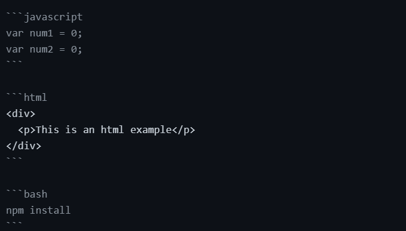

<!-- PROJECT SHIELDS -->

[![Contributors][contributors-shield]][contributors-url]
[![Forks][forks-shield]][forks-url]
[![Stargazers][stars-shield]][stars-url]
[![Issues][issues-shield]][issues-url]
[![MIT License][license-shield]][license-url]
[![LinkedIn][linkedin-shield]][linkedin-url]

<br />
<p align="center">

<p align="center"><strong>Markdown Cheat Sheet</strong></p>
</p>

---

<br />
<details open="open">
  <summary><strong>Table of Contents</strong></summary>

- [Headers](#headers)
- [Quotes](#quotes)
- [Emphasis](#emphasis)
- [Horizontal Rule](#horizontal-rule)
- [Lists](#lists)
- [Links](#links)
- [Images](#images)
- [Code](#code)
- [Tables](#tables)
- [Custom HTML](#custom-html)
- [Custom CSS](#custom-css)

</details>

## Headers

Headers are defined by the '#' symbol. One '#' for H1, two for H2, etc.

```md
# Heading 1

## Heading 2

...

###### Heading 6
```

# Heading 1

## Heading 2

...

###### Heading 6

## Quotes

Quotes are defined by the '>' symbol.

```md
> This is quote

> ### This is header quote
```

> This is quote

> ### This is header quote

## Emphasis

Add emphasis with asterisks '\*' and underscores '\_'.

Two before and after (no spaces) a section of texts makes it bold.

```md
**This text** is bold
```

**This text** is bold

One before and after (no spaces) a section of texts makes it italic.

```md
_This text_ is italic
```

_This text_ is italic

Create strike through text using tilde '~'.

Two before and after (no spaces) a section of texts makes it strike-through.

```md
~~This text~~ is strike-through
```

~~This text~~ is strike-through

## Horizontal Rule

A horizontal rule gives a visible line break. You can create one by putting three or more hyphens, asterisks or underscores (-, \*, \_).

```md
---
```

---

## Lists

You can create sub-lists by indenting.

Create unordered lists using '-', '\*', '+'.

```md
- List Item 1
- List Item 2
- List Item 3
  - Sub-List Item 1
  - Sub-List Item 2
```

- List Item 1
- List Item 2
- List Item 3
  - Sub-List Item 1
  - Sub-List Item 2

Create ordered lists using a number prefix.

```md
1. List Item 1
2. List Item 2
3. List Item 3
   1. Sub-List Item 1
   2. Sub-List Item 2
```

1. List Item 1
2. List Item 2
3. List Item 3
   1. Sub-List Item 1
   2. Sub-List Item 2

Create task list using brackets [].

```md
- [x] Task 1
- [x] Task 2
- [ ] Task 3
```

- [x] Task 1
- [x] Task 2
- [ ] Task 3

Note - Task list is supported by GitHub

## Links

Create a link by surrounding it with angle bracket.

```md
<https://github.com/ganesh-tyjo>
```

<https://github.com/ganesh-tyjo>

Create a link with text by surrounding text with brackets, [], and link immediately following with parenthesis ().

```md
[My GitHub Profile](https://github.com/ganesh-tyjo)
```

[My GitHub Profile](https://github.com/ganesh-tyjo)

You can also show alias for your original link when mouse gets hover over your link. You can do that by providing alias immediately after specifying link in parenthesis ().

```md
[My GitHub Profile](https://github.com/ganesh-tyjo 'github/ganesh-tyjo')
```

[My GitHub Profile](https://github.com/ganesh-tyjo 'github/ganesh-tyjo')

What if you needed to reuse a link several times? Well, you could copy and paste that link each time. That means, if you need to update the link, you will have to do it each time its used. There's a better way!

Create reference style links by defining your link with a 'key' inside of brackets, colon, space, and the link.

```
[my-profile-link]: https://github.com/ganesh-tyjo
```

[my-profile-link]: https://github.com/ganesh-tyjo

Then use the reference style link by using your text inside of brackets followed by the link 'key' inside of bracket.

```md
[My GitHub Profile][my-profile-link]
```

[My GitHub Profile][my-profile-link]

You can also link to other locations on your markdown page. Remember, your Markdown will get converted to HTML, so you can, in theory, use a anchor tag to link to an element with a specific ID.

When you create a header tag, it implicitly creates an id property.

Ex - '# Header' becomes `<h1 id="header">Header</h1>`

Names will be converted to ids by replacing spaces with hyphens and uppercase letters with lowercase letters (think css naming convention).

Ex 'Header Info' becomes header-info

Now link to `headers` section of this document

```md
[Go To Headers](#headers)
```

[Go To Headers](#headers)

## Images

Defining an image is similar to defining a link, except you prefix it with '!'.

```md

```


## Code

You can do inline code with back-ticks.

```md
`This text` is inline code
```

`This text` is inline code

You can do blocks of code by surround it with 3 back-ticks (\`\`\` \`\`\`).



```javascript
var num1 = 0;
var num2 = 0;
```

```html
<div>
  <p>This is an html example</p>
</div>
```

```bash
npm install
```
## Tables

Tables are useful for displaying rows and columns of data. Column headers can be defined in between pipes (|). Headers are separated from table content with a row of dashes (-) (still separated by pipes), and there must be at least 3 dashes between each header. The row data follows beneath (still separated by pipes).

```md
| Header 1    | Header 2    | Header 3    |
| ----------- | ----------- | ----------- |
| Row 1 Col 1 | Row 1 Col 2 | Row 1 Col 3 |
```

| Header 1    | Header 2    | Header 3    |
| ----------- | ----------- | ----------- |
| Row 1 Col 1 | Row 1 Col 2 | Row 1 Col 3 |

You can also align (center, left, right) the text in a column by using colons (:) in the line breaks between headers and rows. No colon means the default **left alignment**. Colons on each side signifies **center alignment**. And a trailing colon means **right alignment**.

```md
| Header 1                                  |                 Header 2                  |                                  Header 3 |
| ----------------------------------------- | :---------------------------------------: | ----------------------------------------: |
| Aligned Left                              |              Aligned Center               |                             Aligned Right |
| Large string to show alignment is working | Large string to show alignment is working | Large string to show alignment is working |

```

| Header 1                                  |                 Header 2                  |                                  Header 3 |
| ----------------------------------------- | :---------------------------------------: | ----------------------------------------: |
| Aligned Left                              |              Aligned Center               |                             Aligned Right |
| Large string to show alignment is working | Large string to show alignment is working | Large string to show alignment is working |

Note - Table alignment supported by GitHub

## Custom HTML

Since Markdown gets automatically converted to HTML, you can add raw HTML directly to your Markdown.

```html
<p class="paragraph">This is a paragraph created with HTML</p>
```

<p class="paragraph">This is a paragraph created with HTML</p>

## Custom CSS

You can also add custom CSS to your Markdown to add additional styling to your document. You can also include CSS by including a style tag.

```css
<style>
.paragraph{
  color:#31a1d6;
  border: 1px solid #e8e9ea;
  border-radius:15px;
  padding:10px;
}
</style>
```

Note - Custom CSS is supported by markdown but GitHub ignores custom CSS, so whatever written inside `<style></style>` tag won't show any difference in GitHub markdown preview. Also not sure which previewers supports custom CSS.

<!-- MARKDOWN LINKS & IMAGES -->

[contributors-shield]: https://img.shields.io/github/contributors/ganesh-tyjo/markdown-cheat-sheet.svg?style=for-the-badge
[contributors-url]: https://github.com/ganesh-tyjo/markdown-cheat-sheet/graphs/contributors
[forks-shield]: https://img.shields.io/github/forks/ganesh-tyjo/markdown-cheat-sheet.svg?style=for-the-badge
[forks-url]: https://github.com/ganesh-tyjo/markdown-cheat-sheet/network/members
[stars-shield]: https://img.shields.io/github/stars/ganesh-tyjo/markdown-cheat-sheet.svg?style=for-the-badge
[stars-url]: https://github.com/ganesh-tyjo/markdown-cheat-sheet/stargazers
[issues-shield]: https://img.shields.io/github/issues/ganesh-tyjo/markdown-cheat-sheet.svg?style=for-the-badge
[issues-url]: https://github.com/ganesh-tyjo/markdown-cheat-sheet/issues
[license-shield]: https://img.shields.io/github/license/ganesh-tyjo/markdown-cheat-sheet.svg?style=for-the-badge
[license-url]: https://github.com/ganesh-tyjo/markdown-cheat-sheet/blob/master/LICENSE
[linkedin-shield]: https://img.shields.io/badge/-LinkedIn-black.svg?style=for-the-badge&logo=linkedin&colorB=555
[linkedin-url]: https://linkedin.com/in/ganesh-tyjo
